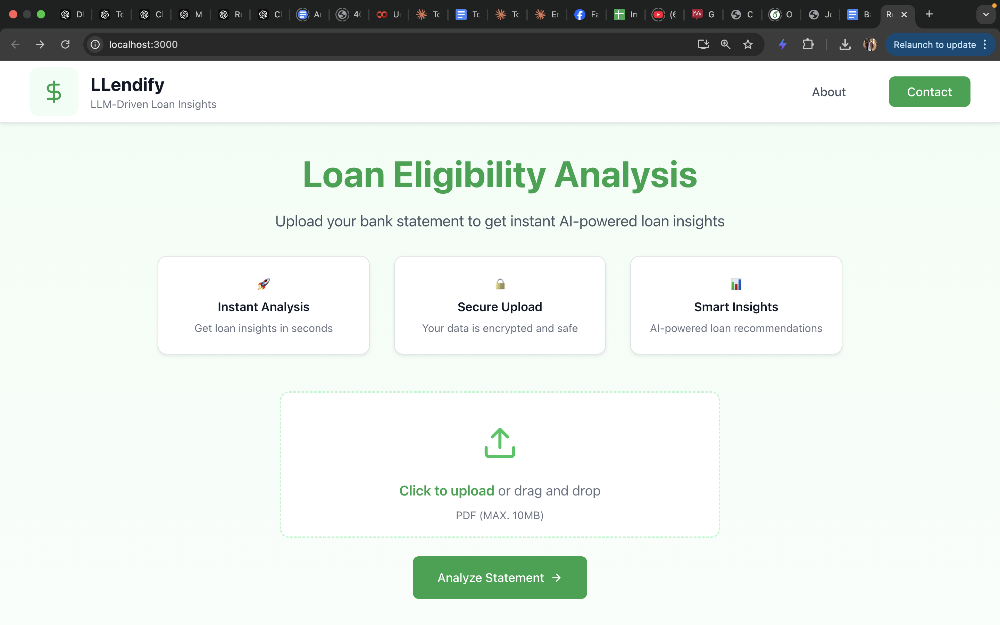
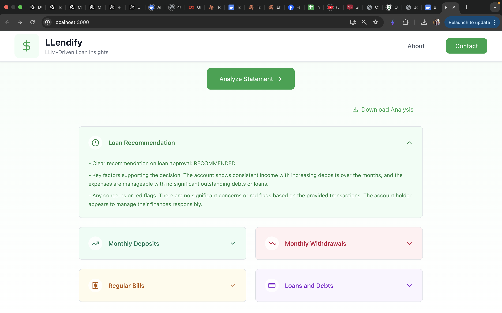

# LLendify - LLM-Driven Loan Insights

LLendify leverages LLM technology to analyze bank statements and provide instant loan eligibility insights. Upload your bank statement PDF to receive AI-powered analysis of income patterns, spending habits, and creditworthiness. Get comprehensive financial assessments and loan recommendations in seconds.




## 🚀 Features

- 📊 Instant AI-powered loan analysis
- 🔒 Secure document processing with encryption
- 💡 Smart financial insights and recommendations
- 📱 Responsive design for all devices
- ⬇️ Downloadable analysis reports
- 🛡️ Data privacy focused

## 🛠️ Tech Stack

### Frontend
- React.js
- Tailwind CSS
- Lucide Icons
- Axios for API calls
- File handling utilities

### Backend
- FastAPI
- Python 3.9+
- LangChain
- PyPDF2 for PDF processing
- Custom PDF parsing pipeline

## 📁 Project Structure

### Frontend (`/bank-analyzer-ui`)
```
bank-analyzer-ui/
├── public/
├── src/
│   ├── components/
│   │   ├── common/
│   │   │   └── Modal.jsx
│   │   └── layout/
│   │       ├── Footer.jsx
│   │       ├── Layout.jsx
│   │       └── Navbar.jsx
│   ├── utils/
│   │   └── downloadUtils.js
│   ├── styles/
│   │   └── globals.css
│   ├── App.jsx
│   └── index.js
└── package.json
```

### Backend (`/src`)
```
src/
├── analysis_pipeline.py
├── api.py
├── app.py
├── pdf_parser.py
├── prompt_templates.py
├── Bank_statement_1.pdf
├── Bank_statement_2.pdf
├── Bank_statement_3.pdf
├── Bank_statement_4.pdf
└── .env
```

## 🚀 Getting Started

### Prerequisites
- Node.js (v14 or higher)
- Python 3.9+
- pip
- Git
- OpenAI API key

### Frontend Setup
1. Clone the repository
   ```bash
   git clone https://github.com/junayed-hasan/llendify.git
   cd llendify/bank-analyzer-ui
   ```

2. Install dependencies
   ```bash
   npm install
   ```

3. Start the development server
   ```bash
   npm start
   ```

The frontend will be available at `http://localhost:3000`

### Backend Setup
1. Navigate to the backend directory
   ```bash
   cd src
   ```

2. Create and activate a virtual environment
   ```bash
   python -m venv venv
   source venv/bin/activate  # On Windows, use: venv\Scripts\activate
   ```

3. Install dependencies
   ```bash
   pip install -r requirements.txt
   ```

4. Create a `.env` file in the src directory (if not exists)
   ```bash
   touch .env
   ```

5. Add your OpenAI API key to the `.env` file
   ```
   OPENAI_API_KEY=your_api_key_here
   ```

6. Start the FastAPI server
   ```bash
   uvicorn app:app --reload
   ```

The API will be available at `http://localhost:8000`

## 🧪 Testing

### Frontend Testing
1. Run the test suite
   ```bash
   npm test
   ```

### Backend Testing
1. Ensure your virtual environment is activated
2. Make sure your `.env` file contains the OpenAI API key
3. Sample bank statements are available in the src directory:
   - Bank_statement_1.pdf
   - Bank_statement_2.pdf
   - Bank_statement_3.pdf
   - Bank_statement_4.pdf
4. Test the API endpoints using these sample files

### Testing with Sample Files
1. Use any of the provided sample PDF files in the src directory
2. Upload through the UI (file should be a PDF)
3. The analysis results will be displayed and can be downloaded

## 📄 License

This project is licensed under the MIT License - see the [LICENSE](LICENSE) file for details.

## 🤝 Contributing

Contributions are welcome! Please feel free to submit a Pull Request.

1. Fork the project
2. Create your feature branch (`git checkout -b feature/AmazingFeature`)
3. Commit your changes (`git commit -m 'Add some AmazingFeature'`)
4. Push to the branch (`git push origin feature/AmazingFeature`)
5. Open a Pull Request

## 📞 Contact

Mohammad Junayed Hasan
- Email: junayedhasan100@gmail.com
- LinkedIn: [mjhasan21](https://www.linkedin.com/in/mjhasan21/)
